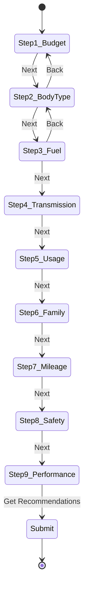

# 🔧 Functional Specification Document (FSD)
# CarDekho Genius

---

## 1. Project Structure

```
cardekho-genius/
├── prisma/
│   ├── schema.prisma
│   ├── seed.ts                # 50+ cars seed data
│   └── dev.db                 # SQLite database
├── src/
│   ├── app/
│   │   ├── layout.tsx         # Root layout + fonts
│   │   ├── page.tsx           # Landing page
│   │   ├── globals.css
│   │   ├── questionnaire/
│   │   │   └── page.tsx       # Multi-step form
│   │   ├── loading/
│   │   │   └── page.tsx       # AI thinking screen
│   │   ├── results/
│   │   │   └── page.tsx       # Top 3 recommendations
│   │   ├── compare/
│   │   │   └── page.tsx       # Side-by-side compare
│   │   └── api/
│   │       ├── recommend/
│   │       │   └── route.ts   # POST - scoring + Gemini
│   │       ├── cars/
│   │       │   ├── route.ts   # GET - all cars
│   │       │   └── [id]/
│   │       │       └── route.ts
│   │       └── compare/
│   │           └── route.ts   # POST - comparison data
│   ├── components/
│   │   ├── ui/                # shadcn components
│   │   ├── landing/
│   │   │   ├── Navbar.tsx
│   │   │   ├── Hero.tsx
│   │   │   ├── HowItWorks.tsx
│   │   │   ├── FeatureCards.tsx
│   │   │   └── Footer.tsx
│   │   ├── questionnaire/
│   │   │   ├── ProgressBar.tsx
│   │   │   ├── QuestionStep.tsx
│   │   │   ├── PillSelector.tsx
│   │   │   ├── CardSelector.tsx
│   │   │   └── NavigationButtons.tsx
│   │   ├── results/
│   │   │   ├── RecommendationCard.tsx
│   │   │   ├── MatchBadge.tsx
│   │   │   ├── SpecsGrid.tsx
│   │   │   └── ProsCons.tsx
│   │   └── compare/
│   │       ├── CompareTable.tsx
│   │       └── HighlightCell.tsx
│   ├── lib/
│   │   ├── prisma.ts          # Prisma client singleton
│   │   ├── scoring.ts         # Weighted scoring engine
│   │   ├── gemini.ts          # Gemini API client
│   │   └── constants.ts       # Enums, config values
│   └── types/
│       └── index.ts           # TypeScript interfaces
├── package.json
├── tailwind.config.ts
├── tsconfig.json
└── .env.local                 # GEMINI_API_KEY
```

---

## 2. TypeScript Interfaces

```typescript
// types/index.ts

interface Car {
  id: number;
  make: string;
  model: string;
  variant: string;
  year: number;
  exShowroomPrice: number; // in Lakhs
  bodyType: "SUV" | "Sedan" | "Hatchback" | "MPV";
  fuelType: "Petrol" | "Diesel" | "Electric" | "Hybrid";
  transmission: "Automatic" | "Manual";
  engineCC: number;
  mileage: number;
  safetyRating: number; // 0-5
  seatingCapacity: number;
  bootSpace: number;
  groundClearance: number;
  power: string;
  torque: string;
  pros: string[];
  cons: string[];
  imageUrl?: string;
}

interface UserPreferences {
  budget: string;        // "5-8" | "8-12" | "12-18" | "18-25" | "25+"
  bodyType: string;      // Car body type or "no_preference"
  fuelType: string;      // Fuel type or "no_preference"
  transmission: string;  // "Automatic" | "Manual" | "no_preference"
  usage: string;         // "city" | "highway" | "mixed" | "offroad"
  familySize: string;    // "1" | "2-3" | "4-5" | "5+"
  mileageImportance: number;      // 1-3
  safetyImportance: number;       // 1-3
  performanceImportance: number;  // 1-3
}

interface Recommendation {
  rank: number;
  car: Car;
  matchPercentage: number;
  explanation: string;
  highlightedPros: string[];
  highlightedCons: string[];
}

interface RecommendResponse {
  recommendations: Recommendation[];
  totalCarsAnalyzed: number;
  userPreferences: UserPreferences;
}
```

---

## 3. API Contracts

### POST `/api/recommend`

**Request:**
```json
{
  "budget": "8-12",
  "bodyType": "SUV",
  "fuelType": "Petrol",
  "transmission": "Automatic",
  "usage": "city",
  "familySize": "4-5",
  "mileageImportance": 3,
  "safetyImportance": 3,
  "performanceImportance": 1
}
```

**Response (200):**
```json
{
  "recommendations": [
    {
      "rank": 1,
      "car": { "id": 12, "make": "Hyundai", "model": "Venue", ... },
      "matchPercentage": 92,
      "explanation": "Based on your ₹12L budget...",
      "highlightedPros": ["4-star safety", "23.4 km/l"],
      "highlightedCons": ["Limited boot space"]
    }
  ],
  "totalCarsAnalyzed": 120,
  "userPreferences": { ... }
}
```

**Error (500):**
```json
{ "error": "Failed to generate recommendations", "fallback": true }
```

### POST `/api/compare`

**Request:** `{ "carIds": [12, 45, 67] }`

**Response:** `{ "cars": [Car, Car, Car] }`

---

## 4. Scoring Algorithm — Pseudocode

```typescript
// lib/scoring.ts

function scoreCar(car: Car, prefs: UserPreferences): number {
  // 1. BUDGET MATCH (0-100) — Weight: 30%
  const [min, max] = parseBudgetRange(prefs.budget);
  let budgetScore = 0;
  if (car.exShowroomPrice >= min && car.exShowroomPrice <= max) {
    budgetScore = 100;
  } else if (car.exShowroomPrice < min) {
    budgetScore = 80; // under budget is okay
  } else {
    const overBy = ((car.exShowroomPrice - max) / max) * 100;
    budgetScore = Math.max(0, 100 - overBy * 5);
  }

  // 2. SAFETY SCORE (0-100) — Weight: 20%
  const safetyBase = (car.safetyRating / 5) * 100;
  const safetyWeight = prefs.safetyImportance / 3;
  const safetyScore = safetyBase * safetyWeight;

  // 3. MILEAGE SCORE (0-100) — Weight: 20%
  const segmentAvgMileage = getSegmentAverage(car.bodyType);
  const mileageBase = Math.min(100, (car.mileage / segmentAvgMileage) * 100);
  const mileageWeight = prefs.mileageImportance / 3;
  const mileageScore = mileageBase * mileageWeight;

  // 4. USAGE FIT (0-100) — Weight: 15%
  let usageFit = 50;
  if (prefs.usage === "city") {
    usageFit = car.mileage > 18 ? 90 : 60;
    if (car.bodyType === "Hatchback") usageFit += 10;
  } else if (prefs.usage === "highway") {
    const bhp = parseInt(car.power);
    usageFit = bhp > 100 ? 90 : 60;
    if (car.bodyType === "Sedan" || car.bodyType === "SUV") usageFit += 10;
  } else {
    usageFit = 75; // mixed
  }

  // 5. FAMILY FIT (0-100) — Weight: 15%
  const requiredSeats = parseFamilySize(prefs.familySize);
  let familyFit = car.seatingCapacity >= requiredSeats ? 100 : 50;
  if (requiredSeats >= 5 && car.bootSpace > 400) familyFit += 10;

  // TOTAL
  return (
    budgetScore  * 0.30 +
    safetyScore  * 0.20 +
    mileageScore * 0.20 +
    usageFit     * 0.15 +
    familyFit    * 0.15
  );
}
```

---

## 5. Gemini AI Integration

```typescript
// lib/gemini.ts

const SYSTEM_PROMPT = `You are a friendly, knowledgeable car advisor for Indian buyers. 
Given user preferences and a recommended car, write a 2-3 sentence personalized explanation. 
Be specific about which needs the car addresses. Mention one honest trade-off. 
Use warm, conversational tone. Use ₹ for prices.`;

async function generateExplanation(
  car: Car, 
  prefs: UserPreferences, 
  matchPct: number
): Promise<string> {
  const prompt = `User wants: Budget ${prefs.budget}L, ${prefs.usage} usage, 
  family of ${prefs.familySize}, priorities: safety(${prefs.safetyImportance}/3), 
  mileage(${prefs.mileageImportance}/3), performance(${prefs.performanceImportance}/3).
  
  Car: ${car.make} ${car.model} ${car.variant} at ₹${car.exShowroomPrice}L
  Specs: ${car.mileage}km/l, ${car.safetyRating}★ safety, ${car.seatingCapacity} seats, 
  ${car.fuelType}, ${car.transmission}, ${car.power}
  Match: ${matchPct}%
  
  Write why this car fits this buyer.`;

  // Call Gemini API
  // Fallback: return template-based explanation if API fails
}
```

**Fallback (no API):**
```
"The {make} {model} fits your ₹{budget}L budget at ₹{price}L. 
With {mileage} km/l and {safetyRating}-star safety, it matches 
your priorities for {topPriority}."
```

---

## 6. Component Specifications

### Questionnaire State Machine



**State:** `{ currentStep: number, answers: Partial<UserPreferences> }`

### Loading Screen Sequence

```typescript
const LOADING_MESSAGES = [
  { text: "Analyzing 120+ cars in our database...", delay: 0 },
  { text: "Matching your budget and preferences...", delay: 1500 },
  { text: "Comparing mileage and safety ratings...", delay: 3000 },
  { text: "Generating your personalized shortlist...", delay: 4500 },
];
// Redirect after max(6000ms, API response time)
```

### Compare Table — Highlight Logic

```typescript
function getBestInRow(cars: Car[], attr: keyof Car, higherIsBetter: boolean) {
  const values = cars.map(c => Number(c[attr]));
  const bestIdx = higherIsBetter 
    ? values.indexOf(Math.max(...values))
    : values.indexOf(Math.min(...values));
  return bestIdx;
}
// Green highlight on best value per row
// Higher is better: mileage, safetyRating, seatingCapacity, bootSpace
// Lower is better: exShowroomPrice
```

---

## 7. State Management

| State | Scope | Storage |
|-------|-------|---------|
| Questionnaire answers | Page session | React useState via context |
| Recommendations result | Cross-page | URL search params + React context |
| Selected cars for compare | Cross-page | URL search params |
| Saved shortlist | Persistent | localStorage |

**Data flow:** Questionnaire → POST `/api/recommend` → Store response in context → Results page reads from context → Compare page reads car IDs from URL params.

---

## 8. Error Handling Matrix

| Scenario | UI Behavior |
|----------|-------------|
| Gemini API timeout (>10s) | Show "Taking longer than usual..." then fallback explanation |
| Gemini API failure | Use template-based fallback explanations |
| No cars match filters | Relax filters, show "Closest matches" with disclaimer |
| Network error on submit | Toast notification + retry button |
| Invalid questionnaire input | Disable "Next" until valid selection made |
| Database error | 500 page with "Try again" CTA |

---

## 9. Environment Variables

```env
# .env.local
DATABASE_URL="file:./prisma/dev.db"
GEMINI_API_KEY="your-gemini-api-key"
```

---

## 10. Setup & Deployment

### Local Development
```bash
git clone <repo>
cd cardekho-genius
npm install
npx prisma generate
npx prisma db push
npx prisma db seed
npm run dev
# → http://localhost:3000
```

### Vercel Deployment
1. Push to GitHub
2. Connect repo to Vercel
3. Set env vars: `GEMINI_API_KEY`
4. SQLite note: Use Turso or Vercel KV for production persistence (SQLite is file-based, won't persist on serverless). For demo, seed on build works.

### Single-Command Setup (Docker)
```dockerfile
FROM node:20-alpine
WORKDIR /app
COPY . .
RUN npm ci && npx prisma generate && npx prisma db push && npx prisma db seed
EXPOSE 3000
CMD ["npm", "run", "dev"]
```

---

## 11. Testing Checklist

| Test | Type | Criteria |
|------|------|----------|
| Landing → Questionnaire nav | E2E | CTA click navigates correctly |
| All 9 questions render | Component | Each step shows correct options |
| Back button preserves answers | Component | Previous selections remain |
| API returns top 3 | Integration | Valid response with 3 cars |
| Match % is 0-100 | Unit | Scoring function bounds check |
| Gemini fallback works | Integration | Template used when API fails |
| Compare table renders | Component | All attributes shown correctly |
| Best-in-row highlighting | Unit | Correct cell highlighted |
| Save shortlist | E2E | Data persists in localStorage |
| Mobile responsive | Visual | All screens work at 375px |

---

> [!NOTE]
> Designs will be provided separately via Stitch. This FSD defines the functional architecture — components, APIs, algorithms, and data flow needed for implementation.
