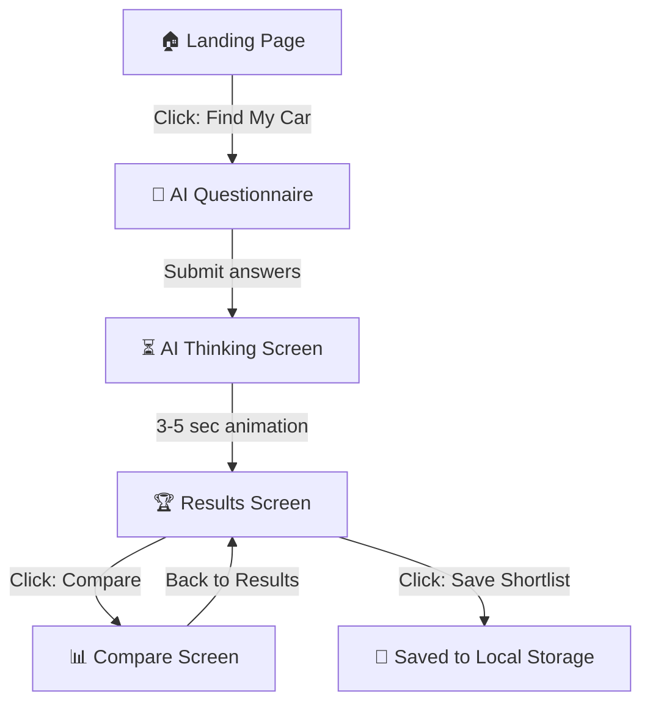

# 📋 Product Requirements Document (PRD)
# CarDekho Genius — AI-Powered Car Recommendation Platform

---

## 1. Product Overview

| Field | Value |
|-------|-------|
| **Product Name** | CarDekho Genius (CDG) |
| **Tagline** | *"Find your perfect car in 60 seconds."* |
| **Version** | 1.0 |
| **Author** | SoloMahesh |
| **Created** | 2026-05-09 |
| **Status** | Draft — Awaiting Review |

### One-Liner
An AI-powered car research platform that transforms the overwhelming car-buying experience into a simple, guided journey — from confusion to a confident shortlist in under a minute.

---

## 2. Problem Statement

### The Pain
Car buyers in India face **decision paralysis**:
- **120+ car models** across 20+ brands in the ₹5L–₹30L segment alone
- Specs are technical and hard to compare (torque, ground clearance, NCAP ratings)
- Existing platforms are **research tools, not decision tools** — they show data but don't guide decisions
- Buyers spend **weeks** going back and forth between tabs, YouTube reviews, and dealer visits

### The Insight
Most buyers can articulate their **needs** (budget, family size, city/highway, safety preference) but can't translate those needs into the right car. That translation is the gap.

### The Opportunity
Build an **AI-powered recommendation engine** that:
1. Asks the right questions (lifestyle questions, not car jargon)
2. Scores every car against the buyer's profile
3. Returns a curated top-3 shortlist with human-readable explanations
4. Lets buyers compare those cars side-by-side

---

## 3. Target Users

### Primary Persona: The First-Time Buyer

| Attribute | Detail |
|-----------|--------|
| **Name** | Rahul, 28 |
| **Context** | Getting married, needs a family car |
| **Budget** | ₹8L – ₹14L |
| **Knowledge** | Low — knows brand names, not specs |
| **Behavior** | Googles "best car under 12 lakhs", watches YouTube, asks friends |
| **Frustration** | "Everyone recommends something different. I just want someone to tell me what's right for ME." |

### Secondary Persona: The Upgrader

| Attribute | Detail |
|-----------|--------|
| **Name** | Priya, 35 |
| **Context** | Owns a hatchback, wants to upgrade to an SUV |
| **Budget** | ₹15L – ₹25L |
| **Knowledge** | Medium — understands basics, wants data-backed decisions |
| **Frustration** | "I've narrowed it down to 5 options but can't decide between them." |

---

## 4. Product Scope

### 4.1 In Scope (MVP)

| # | Feature | Priority |
|---|---------|----------|
| 1 | Landing page with value proposition & CTA | **MUST** |
| 2 | Multi-step AI questionnaire (9 questions) | **MUST** |
| 3 | AI loading/thinking screen with progressive messages | **MUST** |
| 4 | Results screen — top 3 recommendations with AI explanations | **MUST** |
| 5 | Side-by-side comparison table | **SHOULD** |
| 6 | Save shortlist (local storage) | **SHOULD** |
| 7 | Car dataset (50+ cars seeded in SQLite) | **MUST** |
| 8 | Weighted scoring engine | **MUST** |
| 9 | Gemini AI-generated explanations | **MUST** |

### 4.2 Out of Scope (V1)

- User authentication / accounts
- Dealer integration / lead generation
- Used car listings
- EMI calculator / financing
- Mobile native app
- User reviews / ratings submission
- Admin dashboard
- Car image gallery / 360° views
- Push notifications
- Multi-language support

---

## 5. User Journey — Core Flow



| Step | Screen | User Action | System Response |
|------|--------|-------------|-----------------|
| 1 | Landing | Clicks "Find My Perfect Car" | Navigate to questionnaire |
| 2 | Questionnaire | Answers 9 questions via pill/card selections | Validates, shows progress bar |
| 3 | Questionnaire | Clicks "Get My Recommendations" | POST answers to `/api/recommend` |
| 4 | AI Loading | Waits (watches animated messages) | Backend scores cars → calls Gemini → returns top 3 |
| 5 | Results | Views top 3 cars with match %, explanation, specs | Renders recommendation cards |
| 6 | Results | Clicks "Compare These Cars" | Navigate to compare screen |
| 7 | Compare | Reviews side-by-side table | Renders comparison table |
| 8 | Results | Clicks "Save Shortlist" | Stores in localStorage, shows confirmation |

---

## 6. Screen Specifications

### Screen 1: Landing Page

**Purpose:** Communicate value instantly. Convert visitors to questionnaire.

| Section | Content |
|---------|---------|
| **Navbar** | Logo, "How it Works" link, CTA button |
| **Hero** | Headline: "Find Your Perfect Car in 60 Seconds" · Subhead · Primary CTA |
| **How It Works** | 3-step visual: Answer Questions → AI Analyzes → Get Shortlist |
| **Feature Cards** | "120+ Cars", "AI-Powered Matching", "Personalized Explanations", "Compare" |
| **Sample Output** | Mock recommendation card for expectation setting |
| **Footer** | Minimal — copyright, attribution |

---

### Screen 2: AI Questionnaire (⭐ MOST IMPORTANT SCREEN)

> [!IMPORTANT]
> This is the **most important screen**. Must feel modern, fast, and frictionless — not like a boring form.

#### Questions (9 Steps)

| # | Question | Input Type | Options |
|---|----------|-----------|---------|
| 1 | Budget? | Pill selection | ₹5-8L, ₹8-12L, ₹12-18L, ₹18-25L, ₹25L+ |
| 2 | Body type? | Card selection (icons) | SUV, Sedan, Hatchback, MPV, No Preference |
| 3 | Fuel type? | Pill selection | Petrol, Diesel, Electric, Hybrid, No Preference |
| 4 | Transmission? | Pill selection | Automatic, Manual, No Preference |
| 5 | Primary usage? | Card selection | City, Highway, Mixed, Off-Road |
| 6 | Family size? | Pill selection | Just me, 2-3, 4-5, 5+ |
| 7 | Mileage importance? | Pills | Not Important, Somewhat, Very Important |
| 8 | Safety importance? | Pills | Not Important, Somewhat, Very Important |
| 9 | Performance importance? | Pills | Not Important, Somewhat, Very Important |

**UI:** Progress bar, card/pill selections, next/back buttons, slide transitions

---

### Screen 3: AI Loading / Thinking Screen

| Time | Message |
|------|---------|
| 0s | "Analyzing 120+ cars in our database..." |
| 1.5s | "Matching your budget and preferences..." |
| 3s | "Comparing mileage and safety ratings..." |
| 4.5s | "Generating your personalized shortlist..." |
| 6s | Redirect to Results |

**UI:** Animated loader, pulsing dots, fade-in/out messages, gradient background animation. Min display: 4 seconds. Error state with retry if API fails.

---

### Screen 4: Results Screen (⭐ HIGHEST IMPACT)

> [!IMPORTANT]
> The AI explanation per car is what makes this product feel intelligent.

#### Per-Car Card Contains:
- **Match Badge** — "92% Match" (large, colored)
- **Car Name** — Make + Model + Variant
- **Price** — Ex-showroom in ₹
- **AI Explanation** — 2-3 sentences from Gemini
- **Key Specs** — Mileage, Fuel, Transmission, Safety, Seating
- **Pros / Cons** — 2-3 bullets each

#### Actions:
- "Compare All 3" → Compare screen
- "Save Shortlist" → localStorage
- "Start Over" → Questionnaire

#### AI Explanation Example:
> "Based on your ₹12L budget, family of 4, and preference for safety + mileage, the **Hyundai Venue S(O)** is your best fit. It offers a 4-star NCAP safety rating, 23.4 km/l mileage, and enough cabin space for your family. The only trade-off is slightly less boot space."

---

### Screen 5: Compare Screen

Side-by-side table for 2-3 cars:

| Attribute | Compared |
|-----------|----------|
| Price | ₹X.XX L |
| Body Type | SUV / Sedan / etc |
| Fuel Type | Petrol / Diesel / etc |
| Mileage (km/l) | XX |
| Engine (cc) | XXXX |
| Transmission | Auto / Manual |
| Safety Rating | ⭐ stars |
| Seating Capacity | X |
| Boot Space (L) | XXX |
| Ground Clearance (mm) | XXX |

**Best-in-row highlighting** — green highlight for best value in each row.

---

## 7. AI Matching Logic

### Scoring Formula

```
Total Score = 
    budgetMatch  × 0.30 +
    safetyScore  × 0.20 +
    mileageScore × 0.20 +
    usageFit     × 0.15 +
    familyFit    × 0.15
```

| Component | Weight | Logic |
|-----------|--------|-------|
| **budgetMatch** | 30% | Car price within budget range = 100, slightly over = partial, way over = 0 |
| **safetyScore** | 20% | NCAP rating (0-5 → 0-100), weighted by user's safety importance |
| **mileageScore** | 20% | Normalized mileage vs. segment avg, weighted by user's mileage importance |
| **usageFit** | 15% | City → mileage + compact; Highway → power + comfort; Mixed → balanced |
| **familyFit** | 15% | Seating capacity + boot space vs. family size requirement |

### Pre-Scoring Filters
1. Body type (if not "No Preference")
2. Fuel type (if not "No Preference")
3. Transmission (if not "No Preference")

### Gemini Prompt Template
```
You are a friendly car advisor. The user has these preferences:
- Budget: {budget}, Usage: {usage}, Family: {familySize}
- Priorities: Safety ({safety}), Mileage ({mileage}), Performance ({performance})

Recommended car: {carName} ({carPrice})
Specs: {specs} | Match: {matchPercentage}%

Write 2-3 sentences explaining why this car fits this user.
Be specific. Mention one honest trade-off. Warm, conversational tone.
```

---

## 8. Data Model (Prisma + SQLite)

```prisma
model Car {
  id              Int      @id @default(autoincrement())
  make            String   // "Hyundai"
  model           String   // "Venue"
  variant         String   // "S(O) 1.0 Turbo"
  year            Int      // 2024
  exShowroomPrice Float    // in Lakhs
  bodyType        String   // SUV | Sedan | Hatchback | MPV
  fuelType        String   // Petrol | Diesel | Electric | Hybrid
  transmission    String   // Automatic | Manual
  engineCC        Int
  mileage         Float    // km/l
  safetyRating    Int      // 0-5
  seatingCapacity Int
  bootSpace       Int      // liters
  groundClearance Int      // mm
  power           String   // "120 bhp"
  torque          String   // "172 Nm"
  pros            String   // JSON array as string
  cons            String   // JSON array as string
  imageUrl        String?
  createdAt       DateTime @default(now())
}
```

### Seed Data: 50+ cars across segments
Budget Hatchbacks (₹5-8L) · Premium Hatchbacks (₹7-12L) · Compact Sedans (₹8-12L) · Mid Sedans (₹12-18L) · Compact SUVs (₹8-15L) · Mid SUVs (₹15-25L) · Premium SUVs (₹20-30L+) · MPVs (₹10-20L) · Electric (₹10-25L)

---

## 9. API Endpoints

| Method | Endpoint | Purpose |
|--------|----------|---------|
| `POST` | `/api/recommend` | Run matching + return top 3 with AI explanations |
| `GET` | `/api/cars` | Fetch all cars |
| `GET` | `/api/cars/[id]` | Fetch single car |
| `POST` | `/api/compare` | Get comparison data for selected car IDs |

---

## 10. Tech Stack

| Layer | Technology |
|-------|-----------|
| **Framework** | Next.js 15 (App Router) |
| **Language** | TypeScript |
| **Styling** | TailwindCSS |
| **UI Components** | shadcn/ui |
| **Database** | SQLite + Prisma |
| **AI** | Google Gemini API |
| **Deployment** | Vercel |
| **State** | React useState / useContext |
| **Persistence** | Browser localStorage |

---

## 11. Non-Functional Requirements

| Category | Requirement |
|----------|-------------|
| Performance | Page load < 2s, API response < 5s |
| Responsiveness | Mobile-first, 360px – 1920px |
| Accessibility | Keyboard navigable, ARIA labels |
| SEO | Meta tags, OG tags, heading hierarchy |
| Error Handling | Graceful failures, retry mechanisms |
| Browser Support | Chrome, Safari, Firefox (latest 2 versions) |
| Setup | Single command: `npm run dev` or `docker compose up` |

---

## 12. Risks & Mitigations

| Risk | Mitigation |
|------|------------|
| Gemini API rate limits | Cache responses, fallback static explanations |
| Limited car dataset | Seed 50+ well-researched cars across all segments |
| AI hallucination | Pass exact specs to Gemini, validate output |
| Slow AI response | Loading screen masks latency, 10s timeout |

---

## 13. Future Roadmap

| Phase | Features |
|-------|----------|
| **V1.1** | User accounts, persistent shortlists, share via link |
| **V1.2** | EMI calculator, dealer price estimates |
| **V1.3** | User reviews, community ratings |
| **V2.0** | Used cars, price trends, chatbot advisor |

---

> [!NOTE]
> **Design Note:** UI designs will be created separately using Stitch and integrated during the build phase. This PRD defines functional requirements — visual design specs will be provided separately.
